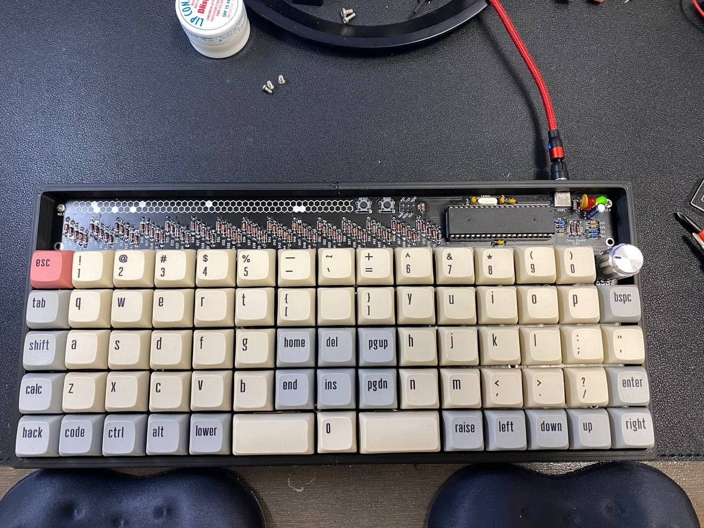
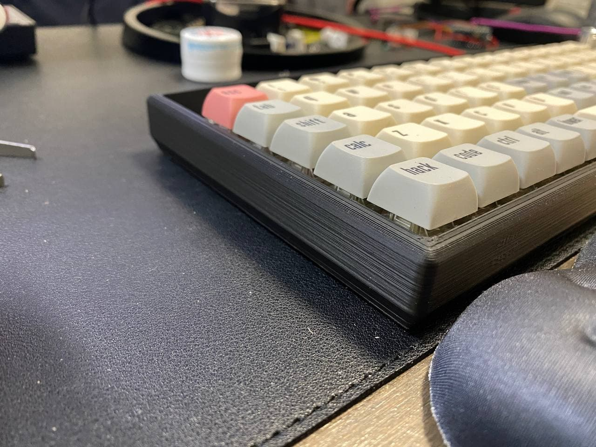
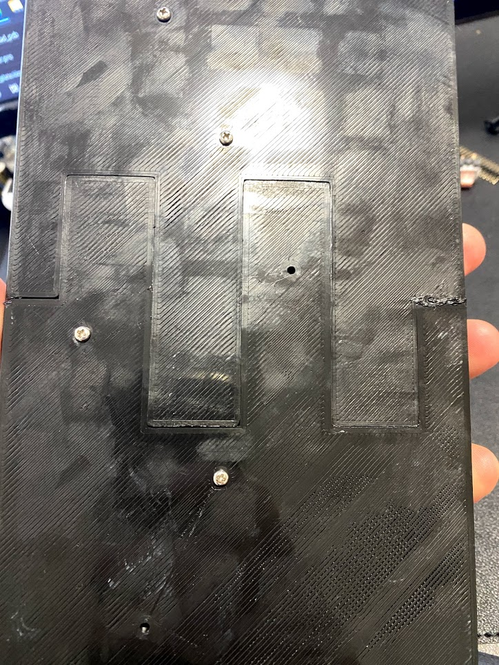
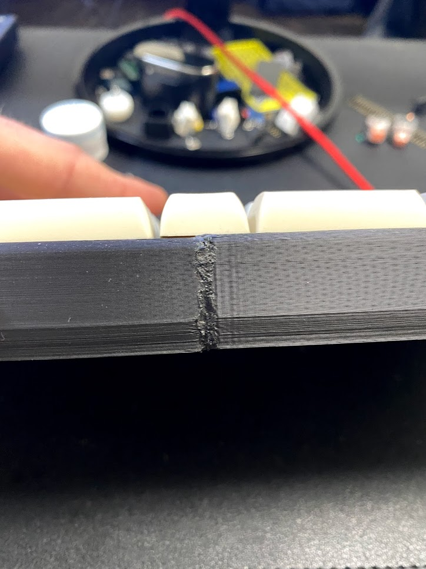

# 3d Printed Case Production and Assembly Notes

## Overview

The 3d printed cases in this directory should all follow these assembly instructions.

## Case Designer Index

| Case Design | Author |
|-------------|--------|
| Simple High Profile Case | jmo808 |

## Sample Pics

## Required Parts

(12) M2.5 5mm Standoffs
(12) M2.5 6mm Pan/Button Head machine screws (for bottom of case to standoffs)
(12) M2.5 3mm Pan/Button Head machine screws (for PCB to standoffs)

## Printing Settings

This was printed with .2 layer height. Lower layers will have a smoother appearance at the risk of much longer print time.

## Assembly Instructions

Once both halves are printed clean up any artifacts and "elephant foot" so that both halves fit nicely.

Install the standoffs with the 6mm screws then use the PCB to secure the halves together. Some filaments have more shrinkage than others and using the PCB as a guide will ensure that the case is assembled square. You will then have the opportunity to fill any gaps vs creating a case that is too small.

Once the PCB is affixed to the standoffs on both halves you can either glue or friction weld the outside of the case together. Friction welding is recommended as it is more mechanically sound, but needs more significant post-processing if a more professional appearance is desired. If you are choosing to use the friction welding method, you will require a high speed handheld rotary tool.

The technique is shown here: https://www.youtube.com/watch?v=Pa2DoE3sirU.

If the only filament you have is 1.75mm you will need to insert two pieces of filament and cut one flush to the collet of your rotary tool this will secure the 1.75mm filament vs. going and buying 2.85mm filament just to friction weld. Left over bits on filament rolls are a perfect source of friction welding material.

**SAFETY NOTE**: *Wear wrap around safety glasses or goggles when friction welding as bits of plastic can shoot out and injure you.*

Once the bottom of the case is welded you can remove the PCB and friction weld the inside of the case for added strength.

## Post Processing

For a more refined appearance I suggest sanding and polishing. My recommendation is to use an orbital sander with Abranet disks as they are much cooler than regular sanding disks and will prevent PLA from getting gummy. Start with 120 grit to remove layer lines, then move on to 220 grit, then 400 grit and follow up with wet hand sanding at 400 grit and final wet hand polishing at 2000 grit.

## Final Assembly

Re-install the populated PCB, install keycaps and enjoy!